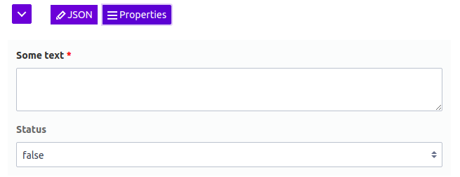

# Django Administration JSON Editor

[](https://travis-ci.org/abogushov/django-admin-json-editor)




Application adds support for editing JSONField in Django Administration via https://github.com/json-editor/json-editor.

## Quick start

Install application via pip:

```bash
pip install django-admin-json-editor
```

Add application to the INSTALLED_APPS settings:

```python
INSTALLED_APPS = [
    ...
    'django_admin_json_editor',
    ...
]
```

Define schema of json field:

```python
DATA_SCHEMA = {
    'type': 'object',
    'title': 'Data',
    'properties': {
        'text': {
            'title': 'Some text',
            'type': 'string',
            'format': 'textarea',
        },
        'status': {
            'title': 'Status',
            'type': 'boolean',
        },
    },
}
```

Use JSONEditorWidget to bind editor to the form field:

```python
class JSONModelAdminForm(forms.ModelForm):
    class Meta:
        model = JSONModel
        fields = '__all__'
        widgets = {
            'data': JSONEditorWidget(DATA_SCHEMA, collapsed=False),
        }
```

### Dynamic schema

It is possible to build dynamic schema for widget:

```python
def dynamic_schema(widget):
    return {
        'type': 'array',
        'title': 'tags',
        'items': {
            'type': 'string',
            'enum': [i for i in Tag.objects.values_list('name', flat=True)],
        }
    }
```

```python
@admin.register(JSONModel)
class JSONModelAdmin(admin.ModelAdmin):
    def get_form(self, request, obj=None, **kwargs):
        widget = JSONEditorWidget(dynamic_schema, False)
        form = super().get_form(request, obj, widgets={'tags': widget}, **kwargs)
        return form
```


## Fieldsets and Rendering Fix
To fix django css issues, due to the fieldset "aligned" css class, we have added 2 options.

JSONEditorWidget can be initialised with independent_fieldset (True/False). If you are putting the json editor in
a seperate fieldset (preferred), you should pass independent_fieldset = True

```python
class JSONModelAdminForm(forms.ModelForm):
    class Meta:
        model = JSONModel
        fields = '__all__'
        widgets = {
            'data': JSONEditorWidget(DATA_SCHEMA, collapsed=False, independent_fieldset=True),
        }
```
Having an independent fieldset allows the relative position of the fields to be maintained as is.

independent_fieldset=True removes the "aligned" class from the parent fieldset, which can break the rendering for other fields
if the json editor is not put in an independent fieldset.

In case you do not create independent fieldset and don't pass independent_fieldset=True, then the initialization of the
editor would push the editor out of the default fieldset, which would break the default ordering of fields,
and also push the editor at the end of the page.

See example app.

